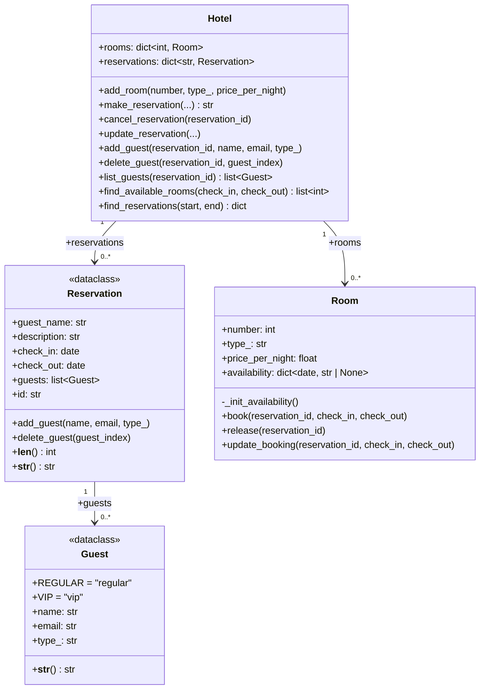

# Ejercicio HotelReservation

Para este ejercicio debes implementar una aplicación de gestión hotelera por consola que permita administrar 
habitaciones y reservas. La aplicación debe permitir las siguientes funcionalidades:

- Agregar habitaciones al hotel.
- Crear, actualizar y cancelar reservas.
- Ver la lista de todas las reservas programadas para un rango de fechas dado.
- Agregar, eliminar y listar huéspedes asociados a una reserva.
- Visualizar las habitaciones disponibles para un rango de fechas dado.

Para implementar la aplicación, debes seguir el siguiente diseño propuesto:

## Diagrama de Clases



Tu tarea es implementar el diseño que se muestra en el diagrama anterior, específicamente las clases `Hotel`,
`Room`, `Reservation` y `Guest` que se deben definir en el módulo `app/model/hotel.py`. Para ello, debes tener en cuenta
las siguientes instrucciones:

---

## Parte 1: Implementación del Modelo

### 1. Clase `Guest`

- La clase se debe implementar como una dataclass.
- Las constantes `REGULAR` y `VIP` se deben implementar como variables de clase con los valores por defecto `"regular"` y
  `"vip"` respectivamente.
- El atributo `name` debe ser de tipo `str` y se inicializa en el constructor de forma obligatoria.
- El atributo `email` debe ser de tipo `str` y se inicializa en el constructor de forma obligatoria.
- El atributo `type_` debe ser de tipo `str` y se inicializa en el constructor de forma opcional, ya que debe tener como
  valor por defecto la constante `REGULAR`.
- El método `__str__` retorna una cadena de texto con el siguiente formato:
  `"Guest {name} ({email}) of type {type_}"`.

### 2. Clase `Reservation`

- La clase se debe implementar como una dataclass.
- Los atributos `guest_name` de tipo `str`, `description` de tipo `str`, `check_in` de tipo `date` y `check_out` de tipo
  `date` se deben inicializar con parámetros en el constructor de forma obligatoria.
- El atributo `guests` de tipo `list[Guest]` no se inicializa con parámetro en el constructor y debe tener como valor
  por defecto una lista vacía.
- El atributo `id` de tipo `str` se inicializa con un parámetro opcional en el constructor, pero debe tener un valor por
  defecto igual al resultado de invocar la función `generate_unique_id` que se encuentra en el módulo `app.services.util`.
  (Utiliza el parámetro `default_factory` de la función `field` de la librería `dataclasses` para asignar el valor por
  defecto).
- El método `add_guest` crea un objeto de la clase `Guest` con los parámetros recibidos y lo agrega a la lista
  `guests` de la reserva.
- El método `delete_guest` recibe un parámetro `guest_index` de tipo `int` que representa un índice de la lista
  `guests`. En el cuerpo del método verifica si el índice es válido (corresponde a un elemento de la lista) y en
  caso afirmativo elimina el elemento de la lista `guests` en la posición indicada por el índice. En caso contrario,
  invoca la función `guest_not_found_error` que se encuentra en el módulo `app.services.util`.
- El método `__len__` retorna el número de noches de la reserva, es decir, la diferencia en días entre `check_out` y
  `check_in`. Esto permite usar la función `len()` sobre un objeto de tipo `Reservation` para obtener la duración
  de la estadía.

  > Ten en cuenta que al restar dos objetos de tipo `date` se obtiene un objeto de tipo `timedelta`, y puedes
  acceder al número de días con el atributo `days`. Por ejemplo: `(check_out - check_in).days`.

- El método `__str__` retorna una cadena de texto con el siguiente formato:
  ```text
  ID: {id}
  Guest: {guest_name}
  Description: {description}
  Dates: {check_in} - {check_out}
  ```

### 3. Clase `Room`

- La clase **no** se debe implementar como una dataclass, sino como una clase normal.
- El atributo `number` de tipo `int` se inicializa con un parámetro en el constructor de forma obligatoria.
- El atributo `type_` de tipo `str` se inicializa con un parámetro en el constructor de forma obligatoria.
- El atributo `price_per_night` de tipo `float` se inicializa con un parámetro en el constructor de forma obligatoria.
- El atributo `availability` de tipo `dict[date, str | None]` no se inicializa con un parámetro en el constructor. Su
  valor inicial es un diccionario vacío.
- Al final del cuerpo del constructor, se debe invocar el método `_init_availability`.
- El método `_init_availability` inicializa el diccionario `availability` con las fechas de los próximos 365 días
  (a partir de la fecha actual) como claves y `None` como valores iniciales.

  > Ten en cuenta que los objetos de la clase `date` se pueden obtener usando `datetime.now().date()` para la fecha
  actual y `timedelta(days=n)` para sumar `n` días a una fecha.

- El método `book` recibe un parámetro `reservation_id` de tipo `str`, un parámetro `check_in` de tipo `date` y un
  parámetro `check_out` de tipo `date`. El método debe asignar el `reservation_id` en todas las fechas del diccionario
  `availability` que estén incluidas en el rango de fechas dado (sin incluir la fecha correspondiente a `check_out`).
  Además, debe verificar que la reserva no se incluya en fechas que ya están ocupadas. Si hay alguna de las fechas
  del rango ocupada, el método invoca la función `room_not_available_error` que se encuentra en el módulo
  `app.services.util`.

  > **Importante:** Primero se debe verificar que TODAS las fechas del rango estén disponibles antes de asignar el
  `reservation_id`. Si alguna fecha está ocupada, se debe invocar el error sin haber modificado ninguna fecha.

- Para completar la clase, pega el siguiente código al final de la clase:

  ```python
  def release(self, reservation_id: str):
      released = False
      for d, saved_id in self.availability.items():
          if saved_id == reservation_id:
              self.availability[d] = None
              released = True
      if not released:
          reservation_not_found_error()

  def update_booking(self, reservation_id: str, check_in: date, check_out: date):
      for d in self.availability:
          if self.availability[d] == reservation_id:
              self.availability[d] = None

      current = check_in
      while current < check_out:
          if self.availability.get(current) is not None:
              room_not_available_error()
          else:
              self.availability[current] = reservation_id
          current += timedelta(days=1)
  ```

### 4. Clase `Hotel`

- La clase **no** se debe implementar como una dataclass, sino como una clase normal.
- El atributo `rooms` de tipo `dict[int, Room]` no se inicializa con un parámetro en el constructor. Su valor inicial
  es un diccionario vacío.
- El atributo `reservations` de tipo `dict[str, Reservation]` no se inicializa con un parámetro en el constructor. Su
  valor inicial es un diccionario vacío.
- El método `add_room` recibe los parámetros `number` de tipo `int`, `type_` de tipo `str` y `price_per_night` de tipo
  `float`. El método verifica si ya existe una habitación con el número dado en el diccionario `rooms`. En caso
  afirmativo, invoca la función `room_already_exists_error` que se encuentra en el módulo `app.services.util`. En caso
  contrario, crea un objeto de la clase `Room` con los parámetros recibidos y lo agrega al diccionario `rooms` con el
  número de la habitación como clave.
- El método `make_reservation` recibe los parámetros `guest_name` de tipo `str`, `description` de tipo `str`,
  `room_number` de tipo `int`, `check_in` de tipo `date` y `check_out` de tipo `date`. El método verifica que la fecha
  `check_in` no sea anterior a la fecha actual (puede utilizar la función `datetime.now().date()`). En caso de que la
  fecha sea anterior a la fecha actual, el método invoca la función `date_lower_than_today_error`. Luego, verifica si
  la habitación con el número dado existe en el diccionario `rooms`. En caso de que no exista, invoca la función
  `room_not_found_error`. En caso contrario, crea un objeto de la clase `Reservation` con los parámetros recibidos,
  invoca el método `book` del objeto de la clase `Room` correspondiente para reservar las fechas, agrega la reserva al
  diccionario `reservations` con el id de la reserva como clave, y retorna el `id` de la reserva creada.
- El método `add_guest` recibe un parámetro `reservation_id` de tipo `str`, un parámetro `name` de tipo `str`, un
  parámetro `email` de tipo `str` y un parámetro `type_` de tipo `str`. El método verifica si la reserva con el
  `reservation_id` existe en el diccionario `reservations`. En caso de que no exista, invoca la función
  `reservation_not_found_error`. En caso contrario, invoca el método `add_guest` del objeto de la clase `Reservation`
  correspondiente con los parámetros recibidos.
- El método `find_available_rooms` recibe un parámetro `check_in` de tipo `date` y un parámetro `check_out` de tipo
  `date` y retorna una lista de números de habitación (`list[int]`). Una habitación está disponible si todas las fechas
  en el rango `[check_in, check_out)` tienen valor `None` en el diccionario `availability` de la habitación.

  > Ten en cuenta que los objetos de tipo `date` se pueden comparar usando los operadores de comparación
  > (`<`, `<=`, `>`, `>=`, `==`, `!=`).

- Para completar la clase, pega el siguiente código al final de la clase:

  ```python
  def update_reservation(self, reservation_id: str, guest_name: str, description: str,
                         room_number: int, check_in: date, check_out: date):
      reservation = self.reservations.get(reservation_id)
      if not reservation:
          reservation_not_found_error()

      current_room_number = None
      for number, room in self.rooms.items():
          if reservation_id in room.availability.values():
              current_room_number = number
              break

      is_new_room = False

      if current_room_number != room_number:
          self.cancel_reservation(reservation_id)
          reservation = Reservation(guest_name=guest_name, description=description,
                                    check_in=check_in, check_out=check_out)
          reservation.id = reservation_id
          self.reservations[reservation_id] = reservation
          is_new_room = True
          if room_number not in self.rooms:
              room_not_found_error()
          self.rooms[room_number].book(reservation_id, check_in, check_out)
      else:
          reservation.guest_name = guest_name
          reservation.description = description
          reservation.check_in = check_in
          reservation.check_out = check_out

      if not is_new_room and current_room_number is not None:
          self.rooms[current_room_number].update_booking(reservation_id, check_in, check_out)

  def cancel_reservation(self, reservation_id: str):
      if reservation_id not in self.reservations:
          reservation_not_found_error()

      self.reservations.pop(reservation_id)

      for room in self.rooms.values():
          if reservation_id in room.availability.values():
              room.release(reservation_id)
              break

  def find_reservations(self, start_date: date, end_date: date) -> dict[date, list[Reservation]]:
      reservations: dict[date, list[Reservation]] = {}
      for reservation in self.reservations.values():
          if start_date <= reservation.check_in <= end_date:
              if reservation.check_in not in reservations:
                  reservations[reservation.check_in] = []
              reservations[reservation.check_in].append(reservation)
      return reservations

  def delete_guest(self, reservation_id: str, guest_index: int):
      reservation = self.reservations.get(reservation_id)
      if not reservation:
          reservation_not_found_error()

      reservation.delete_guest(guest_index)

  def list_guests(self, reservation_id: str) -> list[Guest]:
      reservation = self.reservations.get(reservation_id)
      if not reservation:
          reservation_not_found_error()

      return reservation.guests
  ```

---

## Parte 2: Propuesta de Clase Adicional

En esta parte del ejercicio debes **proponer y diseñar** una clase adicional llamada `HotelService` que represente
los servicios que ofrece el hotel (por ejemplo: servicio a la habitación, spa, lavandería, minibar, transporte, etc.)
y que se integre con el modelo existente.

### Requisitos

1. **Diseño de la clase:** Define los atributos y métodos de la clase `HotelService`. Decide si debe ser una
   `dataclass` o una clase normal, y justifica tu decisión.
2. **Integración con el modelo:** La clase debe integrarse con el modelo existente de forma coherente. Considera
   qué clases necesitan conocer a `HotelService` y qué métodos se deben agregar o modificar para gestionar los
   servicios (agregar, eliminar, listar).
3. **Principios OOP:** Aplica los principios de programación orientada a objetos vistos en clase.
4. **Documentación:** Escribe un breve documento (máximo 1 página) en un archivo `DESIGN.md` en la raíz del proyecto
   que explique tus decisiones de diseño y cómo se integra la clase con el modelo.

### Guias para tener en cuenta

- La clase debe tener una responsabilidad clara y bien definida.
- Los atributos deben tener tipos apropiados y valores por defecto cuando tenga sentido.
- Los métodos deben tener firmas claras y validaciones cuando sea necesario.
- La integración con el modelo debe ser natural y consistente con los patrones ya utilizados en las demás clases.
- El documento de diseño debe justificar las decisiones tomadas, no solo describir lo que se hizo.
